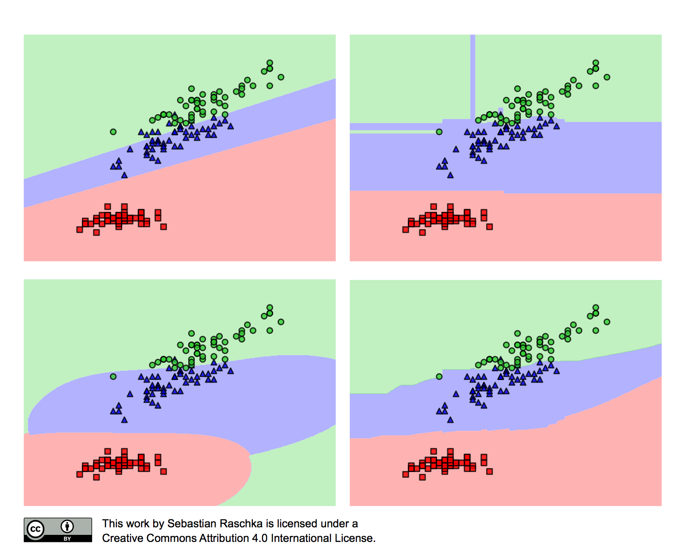

```{r setup, include=FALSE}
knitr::opts_chunk$set(fig.align = "center",
                      fig.width = 4,
                      fig.height = 3)
```

## Idea

**Modelowanie matematyczne** 

Chemy móc opisać pewne zjawisko z rzeczywistego świata za pomocą matematyki, aby potem, na podstawie wykreowanego *modelu*, móc wyciagać pewne wnioski używając narzędzi matematycznych

**Uczenie maszynowe (machine learning, ML)**

Próbujemy zamodelować pewną zależność między parametrami obserwacji, a interesującą nas wartością na podstawie historycznych danych -- czyli stworzyć model na tych danych -- aby następnie przewidywać tę wartość dla nowych danych.

## Przykład

```{r iris, echo=FALSE}
data(iris)
library(ggplot2)

ggplot(iris, aes(x = Sepal.Length, y = Petal.Length, color = Species)) +
  geom_point(size = 3) +
  scale_color_brewer(palette = "Set1") +
  theme_bw()

```

## Przykład 

```{r iris2, echo=FALSE}
ggplot(rbind(iris), aes(x = Sepal.Length, y = Petal.Length, color = Species)) +
  geom_point(size = 3) +
  scale_color_brewer(palette = "Set1") +
  geom_text(data = data.frame(Sepal.Length = c(6.5, 6, 5, 6.1), 
                               Petal.Length = c(4, 3.8, 4.5, 5.9)),
            color = "black", label = "?", fontface = "bold",
            size = 5) +
  theme_bw()

```

## Predykcja

Dzięki modelowi możemy *przewidywać* wartości dla nowych danych.


## Przykład



## Walidacja krzyżowa


## Przeuczenie


## Inne zagadnienia

- rodzaje zadań (regresja, klasteryzacja, ...),
- inżynieria cech,
- strojenie modeli,
- miary skuteczności modeli,
- wyjaśnianie,
- wdrażanie i aktualizacja modeli