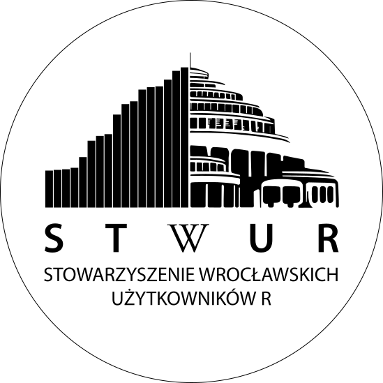
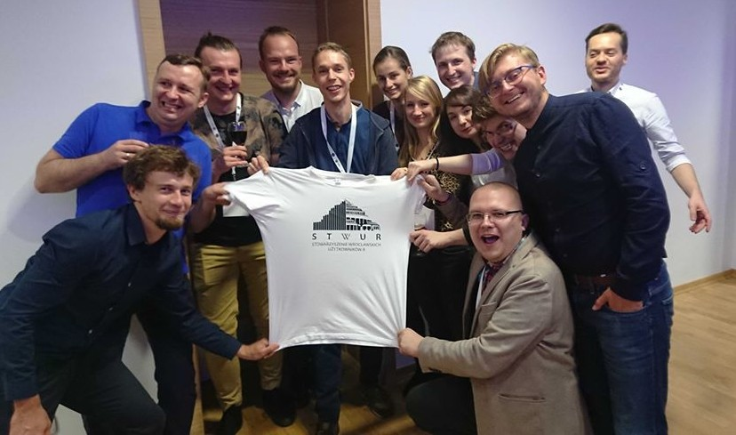
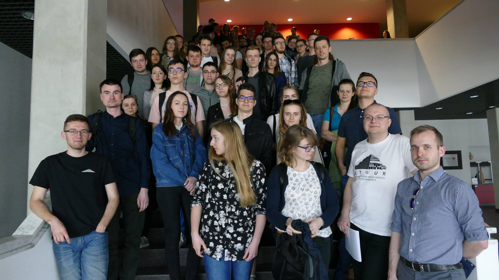

<link href="https://fonts.googleapis.com/css?family=Montserrat&display=swap" rel="stylesheet">

## Wprowadzenie

## Wprowadzenie

Społeczność wrocławskich użytkowników **R** skupiona wokół promocji data science. 

Pierwsze spotkanie: 30-01-2017.

## Plan spotkania

- **10:00-10:10 - otwarcie spotkania i krótki wstęp niemerytoryczny**
- 10:10-11:00 - wstęp do przetwarzania danych w R
- 11:00-11:30 - prezentacja McKinsey & Company
- 11:30-11:50 - przerwa kawowa
- 11:50-12:45 - wizualizacja danych w R, cz. I
- 12:45-13:30 - przerwa na pizzę
- 13:30-14:20 - wizualizacja danych w R, cz. II
- 14:20-14:45 - przerwa kawowa
- 14:45-15:30 - modelowanie w R
- 15:30-15:45 - grupowe zdjęcie
- 15:45-16:15 - wręczenie certyfikatów
- 16:30-… - planszówki w Remont Bar dla chętnych

## Wstęp do przetwarzania danych

- 10:00-10:10 - otwarcie spotkania i krótki wstęp niemerytoryczny
- **10:10-11:00 - wstęp do przetwarzania danych w R**
- 11:00-11:30 - prezentacja McKinsey & Company
- 11:30-11:50 - przerwa kawowa
- 11:50-12:45 - wizualizacja danych w R, cz. I
- 12:45-13:30 - przerwa na pizzę
- 13:30-14:20 - wizualizacja danych w R, cz. II
- 14:20-14:45 - przerwa kawowa
- 14:45-15:30 - modelowanie w R
- 15:30-15:45 - grupowe zdjęcie
- 15:45-16:15 - wręczenie certyfikatów
- 16:30-… - planszówki w Remont Bar dla chętnych

**Paweł Popławski**: pracownik McKinsey&Company, zajmuje się analizą danych dotyczących funkcjonowania, zarządzania i usprawniania organizacji, zarówno z perspektywy pracodawcy jak i pracownika. 

## Wstęp do przetwarzania danych

- 10:00-10:10 - otwarcie spotkania i krótki wstęp niemerytoryczny
- 10:10-11:00 - wstęp do przetwarzania danych w R
- **11:00-11:30 - prezentacja McKinsey & Company**
- 11:30-11:50 - przerwa kawowa
- 11:50-12:45 - wizualizacja danych w R, cz. I
- 12:45-13:30 - przerwa na pizzę
- 13:30-14:20 - wizualizacja danych w R, cz. II
- 14:20-14:45 - przerwa kawowa
- 14:45-15:30 - modelowanie w R
- 15:30-15:45 - grupowe zdjęcie
- 15:45-16:15 - wręczenie certyfikatów
- 16:30-… - planszówki w Remont Bar dla chętnych

**Marta Swiniarska**: Starszy Koordynator ds. Rekrutacji, w McKinsey od ponad 7 lat. Obecnie prowadzi strategiczne działania rekrutacyjne i brandingowe dla EMEA Advanced Analytics Hub zlokalizowanego w McKinsey & Company we Wrocławiu.

**Mateusz Czupala**: Intern w zespole Advanced Analytics (Matematyka, PWr).

 
## Przerwa kawowa

- 10:00-10:10 - otwarcie spotkania i krótki wstęp niemerytoryczny
- 10:10-11:00 - wstęp do przetwarzania danych w R
- 11:00-11:30 - prezentacja McKinsey & Company
- **11:30-11:50 - przerwa kawowa**
- 11:50-12:45 - wizualizacja danych w R, cz. I
- 12:45-13:30 - przerwa na pizzę
- 13:30-14:20 - wizualizacja danych w R, cz. II
- 14:20-14:45 - przerwa kawowa
- 14:45-15:30 - modelowanie w R
- 15:30-15:45 - grupowe zdjęcie
- 15:45-16:15 - wręczenie certyfikatów
- 16:30-… - planszówki w Remont Bar dla chętnych

 
 
## Wizualizacja danych

- 10:00-10:10 - otwarcie spotkania i krótki wstęp niemerytoryczny
- 10:10-11:00 - wstęp do przetwarzania danych w R
- 11:00-11:30 - prezentacja McKinsey & Company
- 11:30-11:50 - przerwa kawowa
- **11:50-12:45 - wizualizacja danych w R, cz. I**
- 12:45-13:30 - przerwa na pizzę
- 13:30-14:20 - wizualizacja danych w R, cz. II
- 14:20-14:45 - przerwa kawowa
- 14:45-15:30 - modelowanie w R
- 15:30-15:45 - grupowe zdjęcie
- 15:45-16:15 - wręczenie certyfikatów
- 16:30-… - planszówki w Remont Bar dla chętnych

**Michał Burdukiewicz**: Bioinformatyk, wykładowca (MI2 DataLab, Wydział Matematyki i Nauk Informacyjnych PW), pasjonat i popularyzator **R**, współzałożyciel STWURa, Fundacji Why R? i DKNB, współorganizator największej polskiej konferencji o **R** i ża**R**łok. 

 
 
## Przerwa na pizzę

- 10:00-10:10 - otwarcie spotkania i krótki wstęp niemerytoryczny
- 10:10-11:00 - wstęp do przetwarzania danych w R
- 11:00-11:30 - prezentacja McKinsey & Company
- 11:30-11:50 - przerwa kawowa
- 11:50-12:45 - wizualizacja danych w R, cz. I
- **12:45-13:30 - przerwa na pizzę**
- 13:30-14:20 - wizualizacja danych w R, cz. II
- 14:20-14:45 - przerwa kawowa
- 14:45-15:30 - modelowanie w R
- 15:30-15:45 - grupowe zdjęcie
- 15:45-16:15 - wręczenie certyfikatów
- 16:30-… - planszówki w Remont Bar dla chętnych

Pizzeria Bravo:

- 27 x Uczta serowa
- 27 x Funghi
- 27 x Chili con carne
- 27 x Bravo
- 27 x Roma

  

## Modelowanie w R

- 10:00-10:10 - otwarcie spotkania i krótki wstęp niemerytoryczny
- 10:10-11:00 - wstęp do przetwarzania danych w R
- 11:00-11:30 - prezentacja McKinsey & Company
- 11:30-11:50 - przerwa kawowa
- 11:50-12:45 - wizualizacja danych w R, cz. I
- 12:45-13:30 - przerwa na pizzę
- 13:30-14:20 - wizualizacja danych w R, cz. II
- 14:20-14:45 - przerwa kawowa
- **14:45-15:30 - modelowanie w R**
- 15:30-15:45 - grupowe zdjęcie
- 15:45-16:15 - wręczenie certyfikatów
- 16:30-… - planszówki w Remont Bar dla chętnych

**Dominik Rafacz**: Student Inżynierii i Analizy Danych na Politechnice Warszawskiej, członek Koła Naukowego Data Science PW, programista i entuzjasta **R**.

  

## Grupowe zdjęcie

- 10:00-10:10 - otwarcie spotkania i krótki wstęp niemerytoryczny
- 10:10-11:00 - wstęp do przetwarzania danych w R
- 11:00-11:30 - prezentacja McKinsey & Company
- 11:30-11:50 - przerwa kawowa
- 11:50-12:45 - wizualizacja danych w R, cz. I
- 12:45-13:30 - przerwa na pizzę
- 13:30-14:20 - wizualizacja danych w R, cz. II
- 14:20-14:45 - przerwa kawowa
- 14:45-15:30 - modelowanie w R
- **15:30-15:45 - grupowe zdjęcie**
- 15:45-16:15 - wręczenie certyfikatów
- 16:30-… - planszówki w Remont Bar dla chętnych

  

## Grupowe zdjęcie

- 10:00-10:10 - otwarcie spotkania i krótki wstęp niemerytoryczny
- 10:10-11:00 - wstęp do przetwarzania danych w R
- 11:00-11:30 - prezentacja McKinsey & Company
- 11:30-11:50 - przerwa kawowa
- 11:50-12:45 - wizualizacja danych w R, cz. I
- 12:45-13:30 - przerwa na pizzę
- 13:30-14:20 - wizualizacja danych w R, cz. II
- 14:20-14:45 - przerwa kawowa
- 14:45-15:30 - modelowanie w R
- 15:30-15:45 - grupowe zdjęcie
- **15:45-16:15 - wręczenie certyfikatów**
- 16:30-… - planszówki w Remont Bar dla chętnych

Certyfikaty odbieramy w holu na dole schodów.

Jeśli jeszcze Twoje dane nie są na meetupie/formularzu, to najwyższy czas je dodać :)  

  

## Grupowe zdjęcie

- 10:00-10:10 - otwarcie spotkania i krótki wstęp niemerytoryczny
- 10:10-11:00 - wstęp do przetwarzania danych w R
- 11:00-11:30 - prezentacja McKinsey & Company
- 11:30-11:50 - przerwa kawowa
- 11:50-12:45 - wizualizacja danych w R, cz. I
- 12:45-13:30 - przerwa na pizzę
- 13:30-14:20 - wizualizacja danych w R, cz. II
- 14:20-14:45 - przerwa kawowa
- 14:45-15:30 - modelowanie w R
- 15:30-15:45 - grupowe zdjęcie
- 15:45-16:15 - wręczenie certyfikatów
- **16:30-… - planszówki w Remont Bar dla chętnych**

Duże podziękowania dla Bartosza Pawliczaka za organizację planszówek! 

  

## Podziękowania

Sponsor: McKinsey & Company.

Instruktorzy: Koło Naukowe Statystyki Matematycznej Gauss, Doktoranckie Koło Naukowe Bioinformatyki.

Wsparcie organizacyjne: Fundacja Why R?.

Partnerzy medialni: MLinPL, R-Ladies Warsaw.
