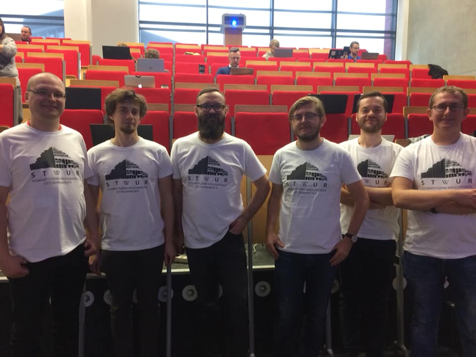
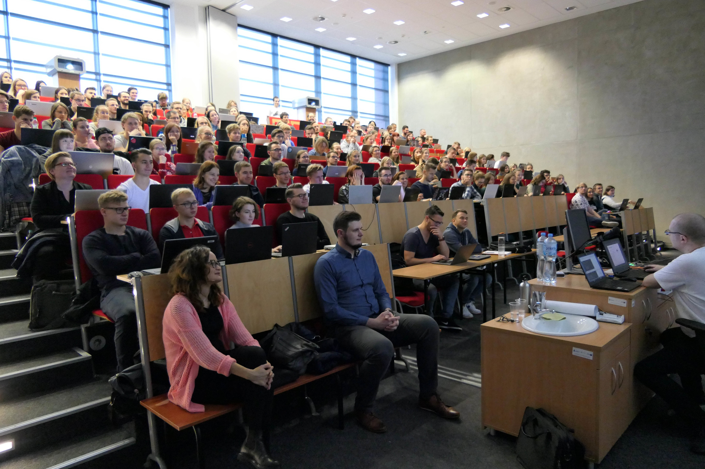

<link href="https://fonts.googleapis.com/css?family=Montserrat&display=swap" rel="stylesheet">

## Spotkanie STWURa

Najbliższe spotkanie: 26.11.2019 o 19:00.

*Integracja dużych zbiorów danych za pomocą sieci korelacyjnych*, Aneta Sawikowska (Xenstats)

## Podziękowania

 - Paweł Bogdan
 - Łukasz Bombała
 - **Jarosław Chilimoniuk**
 - Mateusz Czupała
 - Marcin Kucharski
 - Łukasz Łaszczuk
 - Maciej Małecki

 - Bartosz Pawliczak
 - Filip Pietluch
 - Daria Puchalska
 - Dominik Rafacz
 - Katarzyna Sidorczuk
 - Patryk Wielopolski

## Podziękowania

Bartłomiej Karaban, Bartosz Kolasa, Michał Kurtys.

## Podziękowania

A także:

 - Jakub Kwiecień,
 - Mateusz Staniak.
 
## Podziękowania specjalne

Piotr Sobczyk, http://szychtawdanych.pl/

## Podziękowania

## Social media

 - https://www.facebook.com/stwur/
 - https://www.facebook.com/whyRconf/

## Podziękowania

Sponsor: McKinsey & Company.

Instruktorzy: Koło Naukowe Statystyki Matematycznej Gauss, Doktoranckie Koło Naukowe Bioinformatyki.

Wsparcie organizacyjne: Fundacja Why R?.

Partnerzy medialni: MLinPL, R-Ladies Warsaw.
